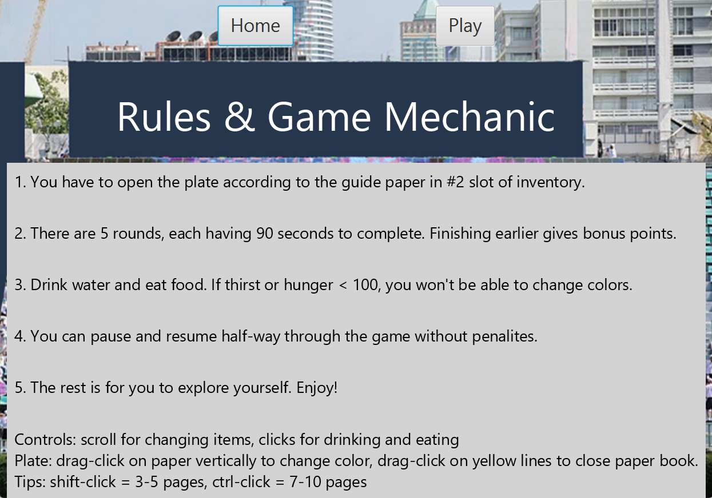
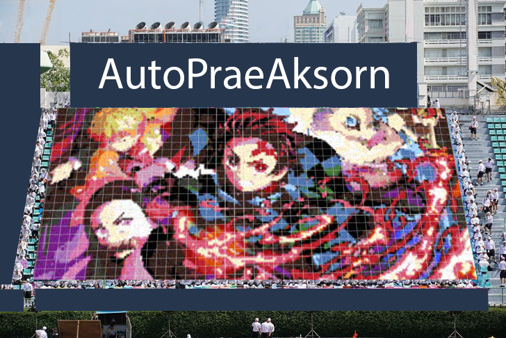

# PraeAksornSimulator

## Installation
You must have Java and JavaFX installed (preferably jdk-19 with JavaFX-sdk-20 )
- git clone https://github.com/bookpanda/PraeAksornSimulator.git
- go to the root directory (./PraeAksornSimulator)
- java -jar --module-path "C:\Program Files\javafx-sdk-20\lib" --add-modules javafx.base,javafx.controls,javafx.graphics,javafx.media,javafx.fxml PraeAksornSimulator.jar

(this path is just an example path to JavaFX library jar files)

## Introduction
PraeAksorn Simulator is inspired by real-life card stunt, which involves assembling a large number of colored papers together to form an image. The objective of this game is to allow you to experience card stunts and form an image within a time limit.
  
## Rules
There are 5 rounds, each having 90 seconds to complete. In each round, players will receive an image they need to create. The instruction paper is presented in the second slot in the inventory. Players must complete the image by flipping pages of colored paper books within the given time limit while referring to the color codes on the instruction paper. Additionally, they must allocate time for drinking water and eating meals to avoid getting exhausted during the card stunt process.

If the hunger or thirst level is below 100, you cannot flip any pages. Moreover, 100 points are deducted every second thirst is lower than 100. You can pause and resume half-way through the game without penalties.

  
## Gameplay
- When you drag a paper up, it will change to the next page. And when you drag a paper down onto the stack, it will go back to the previous page. You can open multiple pages by pressing Shift (3-5 pages) or Ctrl (7-10 pages).
- When you pull the rubber band far enough away from any notebook, that notebook will close.
- You can use the mouse scroll wheel to select different items. There will be an instruction paper available to view color codes. There are also meals and water available to replenish hunger and thirst.

## Scenes

| Preview      |     |      |
|  :----:  |  :----:  |  :----:  |
|  
Home
 |  
Rules
 |  
Gameplay 1
 |
|  
Gameplay 2
 |  
Gameplay 3
 |  
Gameplay 4
 |

## Codes
These images are created using [AutoPraeAksorn](https://github.com/bookpanda/AutoPraeAksorn)

| Preview      |     |      |
|  :----:  |  :----:  |  :----:  |
|  
Amogus
 |  
Attack on Titan
 |  
Demon Slayer
 |
|  
Eighty Six
 |  
Jojo
 |  
Kessoku
 |
|  
One Piece
 |  
Oshi No Ko
 |  
Vinland Saga
 |

